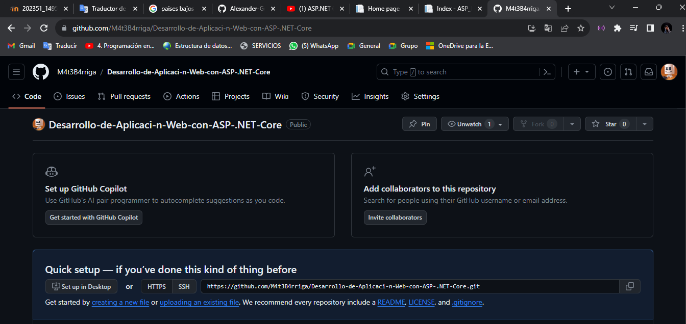
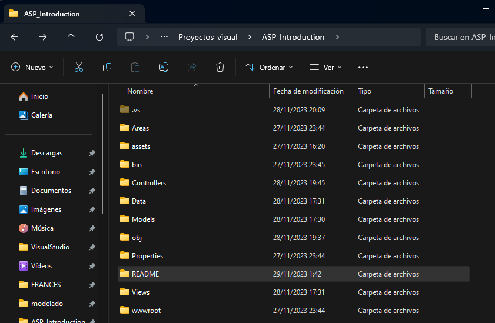
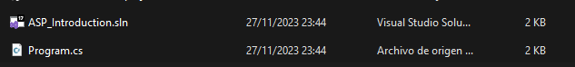
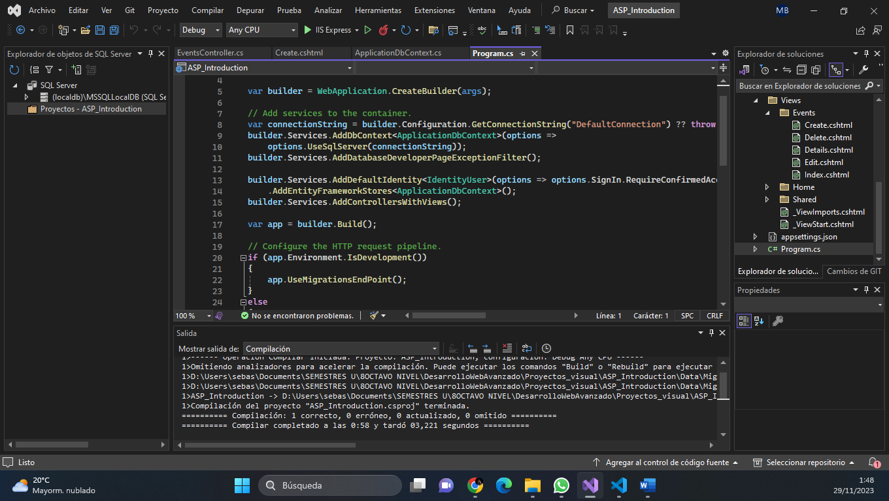
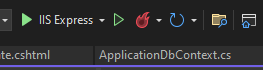
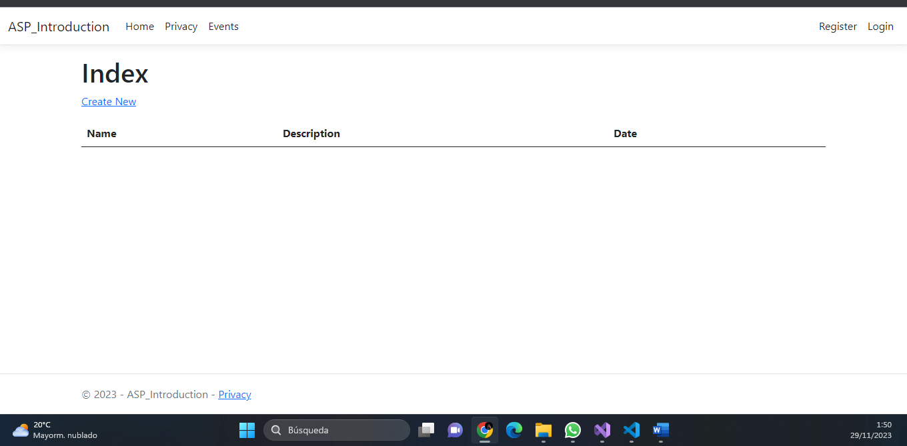

# ASP INTRODUCCION
**Nombre:** Mateo Barriga.
**Fecha:** 28/11/2023
**NRC:** 14956

## Requisitos

- Visual Studio 2022.
- Navegador de su preferencia. 
- Paquetes de instlacion para C#, .NET. 

## Instalación

- Clonamos el siguiente reposito para poder realizar la ejecucion. 
- Entramos a la carpeta y buscamos el archivo, ASP_Introduction.sln.
- Se abrira el Visual Estudio 2022 y podremos ejecutar el proyecto.
- Tomar en cuenta que se debe correr el programa con el formato IIS Expres
- Se podra visualizar el programa en el navegador.
## Ejecución
1. 

2. 

3. 

4. 

5. 
